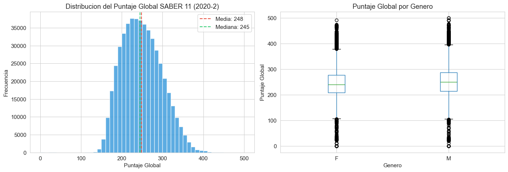
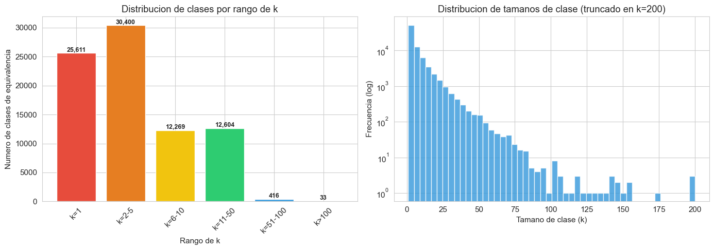
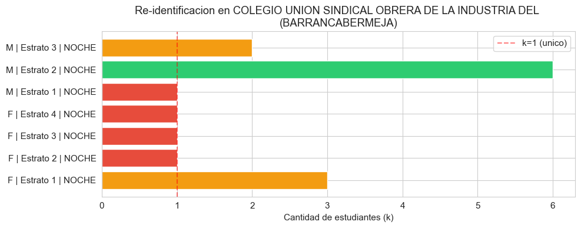
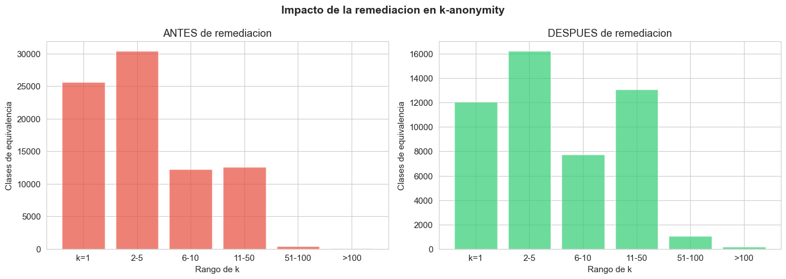

# Auditoría de Gobernanza y Privacidad: Dataset SABER 11 (2020-2)

**Curso:** Gestión y Gobernanza de Datos  
**Profesor:** Santiago Jiménez Londoño  
**Integrantes:** Agustín Figueroa Sierra · Samuel Aristizábal Alzate  
**Fecha:** Mayo de 2026  
**Dataset:** Resultados Saber 11, periodo 2020-2  
**Fuente:** Instituto Colombiano para la Evaluación de la Educación (ICFES)  
**Repositorio del cuaderno:** https://github.com/Figs0203/ProyectoFinal_Gobernanza

---

## 1. Resumen Ejecutivo

El presente informe documenta la auditoría de gobernanza y privacidad realizada sobre el dataset público **Saber 11 — periodo 2020-2**, publicado por el ICFES a través del portal datos.gov.co. El dataset contiene **504,872 registros** de estudiantes que presentaron el Examen de Estado, distribuidos en **81 columnas** que abarcan información demográfica, socioeconómica, institucional y de resultados académicos.

### Hallazgos principales

**Calidad de los datos:** El dataset presenta una completitud global del **98.73%**, con solo una columna (`COLE_BILINGUE`) por encima del umbral de atención del 5% de nulidad (16.44%). No se encontraron registros duplicados. Los puntajes, estratos y códigos geográficos son válidos en su totalidad tras la normalización de los códigos DANE. Se identificaron anomalías puntuales en fechas de nacimiento (edades calculadas fuera de rango razonable en ~8,239 registros).

**Privacidad:** Se clasificaron las 81 columnas según la Ley 1581 de 2012: 6 columnas como **Restringidas**, 36 como **Confidenciales**, 26 como **Internas** y 13 como **Públicas**. Se identificaron dos columnas con PII directa: `ESTU_CONSECUTIVO` (identificador único) y `ESTU_FECHANACIMIENTO` (fecha exacta de nacimiento). El análisis de k-anonymity reveló que el **31.5% de las clases de equivalencia tienen k=1**, lo que significa que 25,611 combinaciones de cuasi-identificadores corresponden a un único estudiante re-identificable.

**Recomendación:** El dataset **no debe publicarse en su forma actual** sin aplicar las medidas de remediación propuestas. La supresión de identificadores directos, la generalización del estrato socioeconómico y el enmascaramiento de colegios pequeños reducen las clases de riesgo (k≤5) en un **49.5%**, logrando un balance razonable entre utilidad analítica y protección de la privacidad.

---

## 2. Mapeo a DAMA-DMBOK2 / DCAM

A continuación se presenta una decisión concreta por cada capacidad relevante del marco DAMA-DMBOK2, vinculada directamente a los hallazgos de esta auditoría.

### 2.1 Data Governance (Gobierno de Datos)

**Decisión:** Se propone a la **Subdirección de Estadísticas del ICFES** como Data Owner del dataset, con autoridad para definir qué variables se publican, bajo qué nivel de agregación y con qué periodicidad. El Data Steward sería el equipo de Gestión de Información (responsable de calidad y diccionario de datos) y el Data Custodian sería la Oficina de Tecnología (almacenamiento, respaldos, control de acceso).

**Justificación:** El DMBOK2 distingue claramente entre el dueño de datos (autoridad de negocio), el steward (calidad operativa) y el custodio (infraestructura). En el caso del ICFES, la decisión de publicar resultados individualizados vs. agregados tiene implicaciones directas sobre la privacidad de menores de edad, lo que requiere una autoridad de negocio clara que asuma esa responsabilidad.

### 2.2 Data Quality (Calidad de Datos)

**Decisión:** Se establecieron umbrales de calidad explícitos para cada dimensión evaluada:

| Dimensión | Umbral definido | Resultado del dataset | Estado |
|-----------|----------------|----------------------|--------|
| Completitud | ≤5% nulos por columna | 40 columnas con algún nulo; solo 1 supera el 5% | ✅ Aceptable |
| Unicidad | 0 duplicados por `ESTU_CONSECUTIVO` | 0 duplicados encontrados | ✅ Cumple |
| Validez | Puntajes en [0-100] por área, [0-500] global | Todos dentro de rango | ✅ Cumple |
| Consistencia | Municipio coherente con departamento | 0 incoherencias (post-normalización) | ✅ Cumple |
| Oportunidad | Datos publicados dentro de 12 meses del periodo | Cumple la ventana de publicación | ✅ Cumple |

**Justificación:** El DMBOK2 establece que la calidad debe medirse contra umbrales definidos por el negocio, no contra estándares arbitrarios. El umbral del 5% se justifica porque las columnas familiares (FAMI_*) tienen un patrón de nulidad consistente (~3-4%) que corresponde a estudiantes que no completaron la encuesta socioeconómica, no a un error de captura.

### 2.3 Data Security (Seguridad de Datos)

**Decisión:** Se clasificaron las 81 columnas en cuatro niveles de sensibilidad alineados con la Ley 1581 de 2012:

- **Restringida (6 columnas):** `ESTU_CONSECUTIVO`, `ESTU_FECHANACIMIENTO`, `ESTU_ESTUDIANTE`, `ESTU_TIENEETNIA`, `COLE_COD_DANE_SEDE`, `ESTU_PRIVADO_LIBERTAD`. Deben suprimirse antes de cualquier publicación.
- **Confidencial (36 columnas):** Datos personales no sensibles (género, nacionalidad, estrato, información familiar). Requieren control de acceso y posible generalización.
- **Interna (26 columnas):** Puntajes, percentiles, indicadores socioeconómicos. Publicables con precaución.
- **Pública (13 columnas):** Datos institucionales del colegio (naturaleza, calendario, ubicación). Publicables sin restricción.

**Justificación:** La Ley 1581 de 2012, Art. 5, define como datos sensibles aquellos que revelan origen racial o étnico (`ESTU_TIENEETNIA`) y la condición de privación de libertad (`ESTU_PRIVADO_LIBERTAD`). El Art. 3 clasifica como datos personales cualquier información vinculada a una persona natural identificada o identificable, lo cual aplica a toda la sección de datos familiares.

### 2.4 Metadata Management (Gestión de Metadatos)

**Decisión:** Se construyó un glosario de 12 términos clave del dominio educativo y un esquema tipado de las 81 columnas que incluye: nombre, tipo de datos, porcentaje de nulidad, valores únicos, ejemplo y clasificación semántica (numérica continua, categórica nominal, categórica ordinal, identificador/código).

**Justificación:** El DMBOK2 establece que los metadatos son la base de la gobernanza. Sin un diccionario de datos, las decisiones de clasificación de sensibilidad y los análisis de calidad carecen de trazabilidad. El glosario permite que un analista externo comprenda el dataset sin conocimiento previo del sistema de pruebas del ICFES.

---

## 3. Calidad del Dataset

### 3.1 Completitud

El dataset presenta una completitud global del **98.73%** (519,164 valores nulos de 40,894,632 celdas). Se identificaron 40 columnas con algún valor nulo, pero solo una supera el umbral de atención del 5%:

| Columna | % Nulos | Observación |
|---------|---------|-------------|
| `COLE_BILINGUE` | 16.44% | Valor faltante para colegios sin clasificación de bilingüismo |
| `FAMI_COMECEREALFRUTOSLEGUMBRE` | 4.01% | Encuesta socioeconómica incompleta |
| `FAMI_TIENECOMPUTADOR` | 4.00% | Encuesta socioeconómica incompleta |
| `FAMI_TRABAJOLABORPADRE` | 3.90% | Encuesta socioeconómica incompleta |

Las columnas de la familia (`FAMI_*`) presentan un patrón uniforme de nulidad entre el 2.5% y el 4%, lo que indica que un grupo consistente de estudiantes (~16,000-20,000) no completó la encuesta socioeconómica. Esto no constituye un error de calidad, sino una característica del proceso de recolección.

### 3.2 Unicidad

No se encontraron registros duplicados, ni evaluando las 81 columnas completas ni por el identificador único `ESTU_CONSECUTIVO`. Los 504,872 registros corresponden a 504,872 estudiantes únicos.

### 3.3 Validez

- **Estratos socioeconómicos:** Los 7 valores encontrados (Estrato 1 a 6 + Sin Estrato) son todos válidos.
- **Género:** Solo dos valores (F: 276,572; M: 228,292), distribución coherente con la población estudiantil.
- **Puntajes por área:** Todos dentro del rango esperado [0, 100], sin valores fuera de rango.
- **Puntaje global:** Dentro del rango [0, 500], media de 248.3 con desviación estándar de 48.7.
- **Códigos DANE:** Tras normalización con ceros a la izquierda, todos los códigos de municipio tienen 5 dígitos válidos correspondientes a 33 departamentos.

### 3.4 Consistencia

- **Municipio vs. departamento:** Tras normalización, se verificó coherencia perfecta (0 inconsistencias) entre el código de municipio del colegio y su departamento.
- **Edades:** La edad promedio calculada es 17.6 años, coherente con estudiantes de grado 11. Sin embargo, se detectaron **310 registros con edad <14 años** y **7,929 con edad >25 años**, además de valores extremos (mínimo -10, máximo 825) que indican errores en el campo `ESTU_FECHANACIMIENTO` para un pequeño porcentaje de registros.
- **Puntaje global vs. áreas:** El `PUNT_GLOBAL` no es la suma aritmética de las 5 áreas, sino que el ICFES utiliza una fórmula de ponderación propia. La correlación entre la suma de áreas y el puntaje global es de **0.9939**, lo cual confirma la coherencia metodológica.\n\n\n*Figura: Distribución normal del Puntaje Global en el dataset.*

### 3.5 Oportunidad

El dataset corresponde al periodo 2020-2 y tiene aproximadamente 6 años de antigüedad. Si bien no refleja los cambios curriculares post-pandemia, mantiene plena relevancia para: análisis de tendencias educativas, estudios de equidad por estrato y género, e investigación sobre brechas regionales. Desde la perspectiva de gobernanza, los riesgos de privacidad no caducan: un estudiante re-identificable en 2020 sigue siendo re-identificable hoy.

---

## 4. Privacidad

### 4.1 Clasificación de sensibilidad

Las 81 columnas del dataset fueron clasificadas según cuatro niveles de sensibilidad:

| Nivel | Cantidad | Criterio |
|-------|----------|---------|
| **Restringida** | 6 | Identificadores directos o datos sensibles (Art. 5, Ley 1581) |
| **Confidencial** | 36 | Datos personales no sensibles (Art. 3, Ley 1581) |
| **Interna** | 26 | Datos de gestión, publicables con agregación |
| **Pública** | 13 | Información institucional, publicable sin restricción |

Las columnas restringidas incluyen: `ESTU_CONSECUTIVO` (identificador único del inscrito), `ESTU_FECHANACIMIENTO` (fecha exacta de nacimiento), `ESTU_TIENEETNIA` (dato sensible sobre origen étnico), `ESTU_PRIVADO_LIBERTAD` (condición jurídica), `COLE_COD_DANE_SEDE` (combinado con otros datos permite localización exacta) y `ESTU_ESTUDIANTE` (columna redundante con un solo valor).

### 4.2 Detección de PII

Se ejecutó un escaneo automático con expresiones regulares sobre todas las columnas de texto, buscando patrones de: cédula colombiana, correo electrónico, teléfono celular, fecha de nacimiento y dirección.

**Resultado:** El único patrón detectado fue la fecha de nacimiento en `ESTU_FECHANACIMIENTO` (100% de coincidencia). El dataset del ICFES **no contiene nombres, cédulas, correos electrónicos ni direcciones** de los estudiantes. Sin embargo, `ESTU_CONSECUTIVO` es un identificador único que permite vincular al estudiante con otros sistemas del ICFES, y `ESTU_FECHANACIMIENTO` proporciona la fecha exacta de nacimiento, lo que constituye PII directa.

### 4.3 Resultados de k-anonymity

Se seleccionaron 5 cuasi-identificadores basados en la literatura del dominio educativo:

| Cuasi-identificador | Columna | Justificación |
|---------------------|---------|---------------|
| Colegio | `COLE_NOMBRE_ESTABLECIMIENTO` | Identifica el entorno escolar |
| Municipio | `COLE_MCPIO_UBICACION` | Ubicación geográfica |
| Género | `ESTU_GENERO` | Atributo demográfico |
| Estrato | `FAMI_ESTRATOVIVIENDA` | Nivel socioeconómico |
| Jornada | `COLE_JORNADA` | Reduce el grupo dentro del colegio |

**Resultados:**

| Métrica | Valor |
|---------|-------|
| Total de clases de equivalencia | 81,333 |
| **k mínimo** | **1** |
| k mediana | 3 |
| k promedio | 6.0 |
| Clases con k=1 (estudiantes únicos) | 25,611 (31.5%) |
| Clases con k≤5 (riesgo alto) | 56,011 (68.9%) |
| Registros en clases k=1 | 25,611 |

\n*Figura: Cantidad de clases de equivalencia distribuidas por su valor k.*\n\nEstos resultados indican un **riesgo significativo de re-identificación**: casi un tercio de las combinaciones de cuasi-identificadores corresponden a un único estudiante en el dataset. Esto es especialmente crítico en colegios pequeños y en jornadas con pocos inscritos.

---

## 5. Ejercicio Exploratorio: Re-identificación en Colegios Pequeños

### Pregunta

¿Cuántos estudiantes son únicos por la combinación género + estrato + jornada en un colegio pequeño?

### Metodología

Se identificaron **4,919 colegios con 30 o menos estudiantes** en el dataset. Se seleccionó un colegio representativo con 15 estudiantes: el **Colegio Unión Sindical Obrera de la Industria del Petróleo**, ubicado en Barrancabermeja.

### Resultado

De los 15 estudiantes del colegio, se formaron 7 combinaciones únicas de género + estrato + jornada. De esas 7 combinaciones, **4 tienen un solo estudiante** (k=1), lo que significa que el **57.1% de las combinaciones permiten identificar a una persona específica**.\n\n\n*Figura: Visualización de las combinaciones (QIDs) y su k asociado en el colegio analizado. Las barras rojas indican riesgo crítico de re-identificación (k=1).*

Por ejemplo, si alguien sabe que una estudiante mujer, de estrato 2, estudia en la jornada nocturna de ese colegio, puede buscar en el dataset y encontrar **exactamente** sus puntajes en las pruebas Saber 11.

### ¿Por qué importa?

Esto no es un escenario teórico. Los puntajes del ICFES afectan el acceso a becas, créditos educativos y admisiones universitarias. Si un empleador, vecino o familiar accede al dataset y conoce el colegio, género y estrato de un joven, podría conocer sus resultados académicos sin su consentimiento. En un país donde el estrato socioeconómico ya es fuente de discriminación, agregar el desempeño académico individual a esa ecuación amplifica el riesgo de estigmatización.

El análisis ampliado sobre los 50 colegios más pequeños confirma el patrón: en promedio, el **54.6% de las combinaciones** en colegios pequeños tienen k=1.

---

## 6. Plan de Remediación Priorizado

### 6.1 Acciones de remediación

| Prioridad | Acción | Columnas/Alcance | Justificación |
|-----------|--------|-------------------|---------------|
| **P1 — Crítica** | Suprimir | `ESTU_CONSECUTIVO`, `ESTU_FECHANACIMIENTO`, `ESTU_ESTUDIANTE`, `ESTU_PRIVADO_LIBERTAD`, `COLE_COD_DANE_SEDE`, `COLE_NOMBRE_SEDE` | Identificadores directos y datos sensibles. Su eliminación no afecta el valor analítico del dataset. |
| **P2 — Alta** | Generalizar estrato | `FAMI_ESTRATOVIVIENDA`: 6 niveles → 3 (Bajo, Medio, Alto) | Reduce la granularidad del cuasi-identificador más discriminante, manteniendo utilidad para análisis de equidad. |
| **P3 — Alta** | Suprimir municipio de residencia | `ESTU_MCPIO_RESIDE`, `ESTU_COD_RESIDE_MCPIO` | Se mantiene el departamento de residencia. El municipio combinado con colegio permite triangulación. |
| **P4 — Media** | Generalizar nombre de colegio | Colegios con <20 estudiantes → `COLEGIO_PEQUEÑO_[DEPTO]` | 2,834 colegios (6.3% de registros) agrupados por departamento para evitar re-identificación en instituciones pequeñas. |

### 6.2 Resultado de la remediación

| Métrica | Antes | Después | Mejora |
|---------|-------|---------|--------|
| Clases de equivalencia | 81,333 | 50,356 | -38.1% |
| Clases con k=1 | 25,611 | 12,050 | **-52.9%** |
| Clases con k≤5 | 56,011 | 28,277 | **-49.5%** |
| k mediana | 3 | 4 | +33.3% |
| Columnas totales | 81 | 73 | -8 columnas |

\n*Figura: Comparativa de la distribución de k-anonymity antes y después de aplicar el plan de remediación priorizado.*\n\nLa remediación logra reducir las clases de máximo riesgo (k=1) en más de la mitad, afectando solo al 6.3% de los registros del dataset. El k mínimo permanece en 1 porque existen combinaciones raras incluso en colegios grandes (por ejemplo, un único estudiante de estrato 6 en jornada nocturna en un colegio oficial), lo cual se documenta transparentemente.

### 6.3 Recomendaciones adicionales

1. **Supresión selectiva:** Para los 12,050 registros que aún tienen k=1, evaluar la eliminación directa del registro o la aplicación de perturbación en los puntajes.
2. **Revisión periódica:** Implementar un proceso automatizado de verificación de k-anonymity cada vez que se publique un nuevo periodo de resultados.
3. **Datos sintéticos:** Para investigaciones que requieran microdatos completos, considerar la generación de datos sintéticos mediante SDV (Synthetic Data Vault) que preserven la estructura estadística sin exponer individuos reales.
4. **Evaluación de Impacto de Privacidad (PIA):** Realizar una PIA formal siguiendo la guía de la SIC antes de cualquier nueva publicación, dado que el dataset involucra menores de edad.

---

## Anexo A: Declaración de Apoyo de IA

| Aspecto | Detalle |
|---------|---------|
| **Herramientas utilizadas** | Claude (Antigravity/Opus), GitHub Copilot |
| **Tareas con apoyo de IA** | Estructura del cuaderno, código de análisis de calidad, generación de regex para PII, código de k-anonymity, generación del glosario inicial, redacción de plantillas para el informe |
| **Tareas manuales** | Definición de umbrales de calidad, clasificación de sensibilidad por columna, análisis de riesgos de re-identificación, selección de cuasi-identificadores, decisiones del plan de remediación, verificación de cifras y hallazgos, redacción final del informe |

Todas las cifras y resultados presentados en este informe fueron verificados manualmente contra los outputs del cuaderno ejecutado. No se incluyeron normas, artículos de ley ni hechos sin verificación previa.

---

## Anexo B: Cómo Ejecutar el Cuaderno

### Requisitos

| Componente | Versión |
|-----------|---------|
| Python | 3.13+ |
| pandas | 3.0+ |
| numpy | 2.3+ |
| matplotlib | 3.x |
| seaborn | 0.13+ |

### Instrucciones

```bash
# 1. Clonar el repositorio (o descargar la carpeta)
git clone <URL_DEL_REPOSITORIO>
cd ICFES

# 2. Crear entorno virtual (recomendado)
python -m venv venv
source venv/bin/activate  # Linux/Mac
# o en Windows:
venv\Scripts\Activate.ps1

# 3. Instalar dependencias
pip install pandas numpy matplotlib seaborn

# 4. Descargar el dataset
# Desde: https://www.datos.gov.co/Educaci-n/Saber-11-2020-2/rnvb-vnyh/data_preview
# Colocar el archivo CSV en la misma carpeta del cuaderno

# 5. Ejecutar el cuaderno
jupyter notebook cuaderno.ipynb
# O abrir con VS Code y seleccionar el kernel del venv
```

### Notas

- El dataset pesa ~470 MB. La carga en memoria consume aproximadamente 634 MB.
- El cuaderno se ejecuta completamente en ~30-60 segundos en un equipo con 8 GB de RAM.
- No se requiere GPU ni conexión a internet durante la ejecución (el dataset debe estar descargado previamente).

---

## Referencias

- DAMA International. (2017). *DAMA-DMBOK: Data Management Body of Knowledge* (2nd ed.). Technics Publications.
- Congreso de la República de Colombia. (2012). Ley Estatutaria 1581 de 2012 — Protección de Datos Personales.
- Presidencia de la República de Colombia. (2013). Decreto 1377 de 2013 — Reglamentario de la Ley 1581.
- Congreso de la República de Colombia. (2014). Ley 1712 de 2014 — Transparencia y del Derecho de Acceso a la Información Pública Nacional.
- Superintendencia de Industria y Comercio (SIC). Guía de Evaluación de Impacto de Privacidad.
- Sweeney, L. (2002). k-anonymity: A model for protecting privacy. *International Journal of Uncertainty, Fuzziness and Knowledge-Based Systems*, 10(05), 557-570.
- ICFES. (2020). Datos abiertos — Resultados Saber 11. Disponible en: https://www2.icfes.gov.co/data-icfes
- Portal de Datos Abiertos de Colombia: https://www.datos.gov.co/

